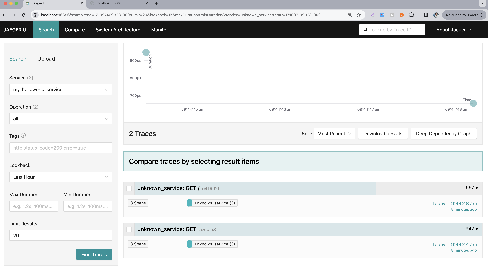

# FastAPI with OpenTelemetry and Jaeger

This project demonstrates how to integrate OpenTelemetry with a FastAPI application to collect telemetry data (traces) and visualize them using Jaeger.

## Overview

The application is a simple FastAPI web service instrumented with OpenTelemetry to collect traces. Jaeger is used as the observability backend to visualize the traces, helping in monitoring and troubleshooting the application.

### Looks like this

- FastAPI
- Jaeger

## Getting Started

### Prerequisites

- Python 3.6+
- Docker
- pip

### Installation

1. **Clone the repository**

   ```bash
   git clone https://github.com/aamersohailgit/fastapi-otel.git
   cd https://github.com/aamersohailgit/fastapi-otel.git
   ```
2. **Create and activate a virtual environment (optional)**

   ```bash
   python3 -m venv venv
   source venv/bin/activate
   ```
3. **Install dependencies**

   ```bash
   pip install -r requirements.txt
   ```

### Running the Application

1. **Start Jaeger with Docker**

   Run Jaeger using Docker with the following command:

   ```bash
   docker run -d --name jaeger \
     -e COLLECTOR_ZIPKIN_HTTP_PORT=9411 \
     -p 5775:5775/udp \
     -p 6831:6831/udp \
     -p 6832:6832/udp \
     -p 5778:5778 \
     -p 16686:16686 \
     -p 14250:14250 \
     -p 14268:14268 \
     -p 14269:14269 \
     -p 9411:9411 \
     jaegertracing/all-in-one:latest
   ```

   Access the Jaeger UI at `http://localhost:16686`.
2. **Run the FastAPI application**

   ```bash
   uvicorn app:app --reload
   ```

   The FastAPI application will be available at `http://localhost:8000`.

### Viewing Traces in Jaeger

- After the application is running and serving requests, navigate to the Jaeger UI (`http://localhost:16686`).
- Select your service from the "Service" dropdown menu and click on "Find Traces" to view the collected traces.

## Contributing

- **AUTHOR** - **AAMER**
- YouTube - [Prograamer YouTube Channel ]([https://youtu.be/MiBSgcnmiAM?si=c99OYctCleoE8AaW]())
